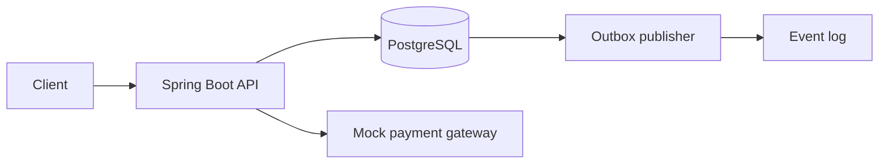

# PayShield

PayShield is a portfolio payment-processing backend that demonstrates reliable payment APIs without handling real card data. It supports idempotent payment creation and refunds, immutable double-entry ledger records, payment lifecycle history, and a transactional outbox.

> Educational project only: it is not PCI-DSS compliant and must not process real card numbers. Use mock tokens only.



## Run locally

Requirements: Java 21+, Maven, and Docker Desktop.

```powershell
mvn clean package
docker compose up --build
```

The API is available at `http://localhost:8080`; Swagger UI is at `http://localhost:8080/swagger-ui.html`; health check is `http://localhost:8080/actuator/health`.

To run tests: `mvn test`. Unit tests cover mock-gateway outcomes and idempotency validation; the PostgreSQL Testcontainers integration test automatically skips when Docker is unavailable.

## Example

```bash
curl -X POST http://localhost:8080/api/v1/payments \
 -H "Content-Type: application/json" -H "Idempotency-Key: order-1001" \
 -d '{"amount":100.00,"currency":"INR","merchantReference":"order-1001","customerId":"customer-7","paymentToken":"tok_visa_success"}'
```

Mock tokens: `tok_visa_success` succeeds, `tok_declined` fails, and `tok_gateway_error` simulates a retryable provider failure.

Use `requests.http` for ready-to-run examples. The detailed design is in [docs/HLD.md](docs/HLD.md) and [docs/LLD.md](docs/LLD.md).

## Limitations and next steps

This single-service demo logs outbox events rather than sending them to Kafka/SQS. A production system would add authentication/authorization, encryption and secret management, rate limiting, a real provider adapter, monitoring, retry/DLQ policy, and asynchronous reconciliation.

## Interview summary

“I built a Spring Boot payment backend which makes client retries safe through an idempotency key plus a request hash. Each successful charge or refund produces balanced, immutable ledger entries. State changes and an outbox event commit in the same database transaction, so an event is never lost after a committed payment.”
