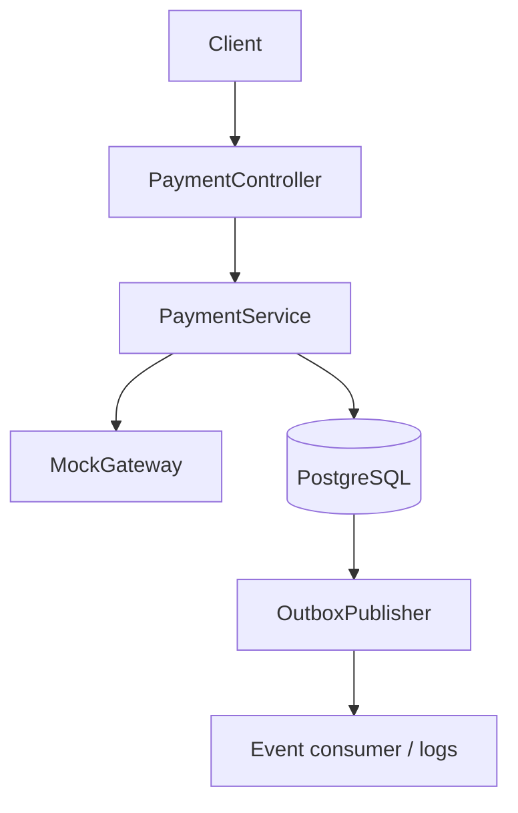

# High-Level Design

## Requirements and assumptions

PayShield creates and refunds mock payments in INR/USD. Clients provide an `Idempotency-Key`; exact replays return the original resource, while a changed payload with the same key yields `409`. No real card or bank data is accepted or stored.

## Components

PostgreSQL is the system of record because money flows need ACID transactions, uniqueness constraints, and durable audit history. Spring Boot provides a small, easily deployable service with health checks and OpenAPI.

## Core flow

1. Validate request and idempotency key.
2. Hash the canonical request representation and look up the key under a database lock.
3. Replay the original response if the hash matches; reject a changed hash.
4. Persist the payment, state transition, ledger rows (on success), and outbox event in one transaction.
5. A scheduled publisher marks committed events published after logging them.

## Reliability and scalability

The unique idempotency-key index is the last line of defence against simultaneous retries. Optimistic versioning protects payment updates. The outbox pattern avoids the dual-write problem: database state and event intent commit atomically. Scaling horizontally is possible because durable coordination lives in PostgreSQL; a production publisher should use row claiming/`SKIP LOCKED`.

## Security

Only opaque mock tokens are stored. Production additions include OAuth/JWT authorization, TLS, encrypted secrets, audit access controls, rate limits, request-size limits, PII minimization, and a PCI-compliant payment-tokenization provider.
