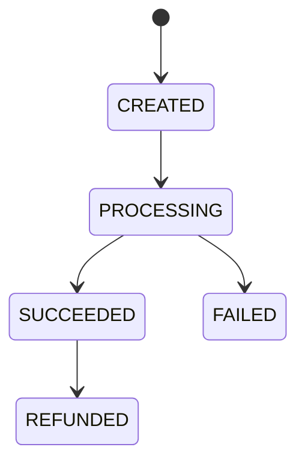

# Low-Level Design

## Data model

| Table | Purpose |
|---|---|
| `payments` | Payment amount, owner, token, current state, version |
| `idempotency_records` | Unique key, SHA-256 request hash, resulting payment |
| `payment_transitions` | Append-only state-change history |
| `ledger_entries` | Immutable debit/credit records |
| `outbox_events` | Events committed with payment state |

Relationships: one payment has many transitions, ledger entries, and outbox events. An idempotency record identifies one payment resource.

## State transitions

## Endpoints

| Endpoint | Purpose |
|---|---|
| `POST /api/v1/payments` | Create/process payment; requires `Idempotency-Key` |
| `GET /api/v1/payments/{id}` | Retrieve current payment state |
| `POST /api/v1/payments/{id}/refunds` | Refund a successful payment; requires a new key |
| `GET /api/v1/payments/{id}/ledger` | Retrieve auditable entries |

All errors return `{ timestamp, status, error, message }`.

## Idempotency algorithm

`PaymentService` hashes `PAYMENT:<request>` or `REFUND:<paymentId>`. It locks an existing key before comparing the stored hash. A match returns the saved resource; a mismatch returns 409. For a new key it inserts an idempotency record protected by its unique constraint, performs business work, and attaches the resource ID. A concurrent insert conflict returns a retryable 409 rather than double-charging.

## Ledger and outbox

A successful payment debits `customer_clearing` and credits `merchant_payable`; a refund reverses those accounts. Rows are never updated by the application. An outbox record stores the event type and compact JSON payload in the same transaction. `OutboxPublisher` logs and timestamps unpublished events every five seconds.
